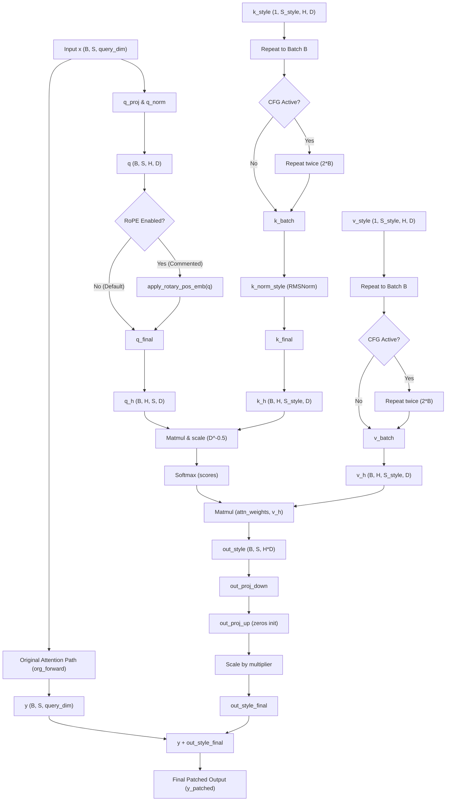

# 🎨 Anima Dual KV Style Network: Architecture & Dual KV Path Report

This document details the internal architecture, mathematical formulation, and positional embedding (RoPE vs No RoPE) behavior of the **Dual KV Style Network** implemented in [anima_train_custom_style.py](file:///c:/Users/d/playground/sd-scripts/anima_train_custom_style.py) for the **Anima** model.

---

## 1. Overview and Core Concept

The Anima Dual KV Style Network is a specialized adaptation framework designed to inject consistent stylistic control into the Diffusion Transformer (DiT) without needing dynamic conditioning inputs (like a reference image or Q-Former/ViT encoders) during inference. 

Instead of dynamically extracting style features, it learns a set of **static, trainable style key-value vectors** directly as network parameters. During training, the DiT model is frozen, and only these style key-value pairs along with a low-rank bottleneck output projection (LoRA) are optimized.

---

## 2. The Dual KV Path Architecture

Each targeted `Attention` module is wrapped by a `StyleDualKVModule`. Inside this wrapper, attention computation is split into two parallel paths:

1. **The Original Attention Path (Main Path)**: Calculates the standard self-attention or cross-attention. This captures the layout, context, and structural properties of the generation.
2. **The Style Attention Path (Added Dual KV Path)**: Uses the queries $\mathbf{q}$ from the main sequence to query the static learnable style database ($\mathbf{k}_{\text{style}}, \mathbf{v}_{\text{style}}$).



### Mathematical Trace & Data Flow

For an input sequence $\mathbf{x} \in \mathbb{R}^{B \times S \times D_{\text{query}}}$:

#### Step 1: Main Path Forward
The original attention forward pass is executed unmodified to obtain the baseline attention output:
$$\mathbf{y} = \text{org\_forward}(\mathbf{x}) \in \mathbb{R}^{B \times S \times D_{\text{query}}}$$

#### Step 2: Query Generation
Queries are generated from the input sequence $\mathbf{x}$ using the original projection and normalization layers:
$$\mathbf{q} = \text{org.q\_norm}\left(\text{Reshape}\left(\text{org.q\_proj}(\mathbf{x})\right)\right) \in \mathbb{R}^{B \times S \times H \times D_{\text{head}}}$$
Where $H$ is the number of heads and $D_{\text{head}}$ is the head dimension.

#### Step 3: Style KV Retrieval & Normalization
The static learnable parameters $\mathbf{k}_{\text{style}}, \mathbf{v}_{\text{style}} \in \mathbb{R}^{1 \times S_{\text{style}} \times H \times D_{\text{head}}}$ (where $S_{\text{style}}$ is the number of style tokens, default `64`) are retrieved.
* **Batch Expansion**: The parameters are duplicated across the batch size $B$:
  $$\mathbf{k}_{\text{style}}^{(B)}, \mathbf{v}_{\text{style}}^{(B)} \in \mathbb{R}^{B \times S_{\text{style}} \times H \times D_{\text{head}}}$$
* **CFG Support**: If Classifier-Free Guidance is active (doubling the batch size for conditional/unconditional branches), they are repeated:
  $$\mathbf{k}_{\text{style}}^{(2B)}, \mathbf{v}_{\text{style}}^{(2B)} \in \mathbb{R}^{2B \times S_{\text{style}} \times H \times D_{\text{head}}}$$
* **Key Normalization**: An independent `RMSNorm` scales the style keys to stabilize attention scores:
  $$\mathbf{k}_{\text{style\_normed}} = \text{RMSNorm}_{\text{style}}(\mathbf{k}_{\text{style}})$$

#### Step 4: Style Multi-Head Attention
Multi-head attention is computed by querying the style keys:
$$\mathbf{q}_h, \mathbf{k}_h, \mathbf{v}_h = \text{Transpose}(\mathbf{q}, \mathbf{k}_{\text{style\_normed}}, \mathbf{v}_{\text{style}})$$
$$\mathbf{S} = \frac{\mathbf{q}_h \mathbf{k}_h^T}{\sqrt{D_{\text{head}}}} \in \mathbb{R}^{B \times H \times S \times S_{\text{style}}}$$
$$\mathbf{A} = \text{Softmax}(\mathbf{S}, \text{dim}=-1)$$
$$\mathbf{o}_h = \mathbf{A} \mathbf{v}_h \in \mathbb{R}^{B \times H \times S \times D_{\text{head}}}$$

#### Step 5: Output Projection and Residual Merge
The style attention output is reshaped back to sequence space:
$$\mathbf{o}_{\text{style}} = \text{Reshape}(\text{Transpose}(\mathbf{o}_h)) \in \mathbb{R}^{B \times S \times (H \cdot D_{\text{head}})}$$
It is projected back to $D_{\text{query}}$ using a low-rank LoRA bottleneck and scaled:
$$\mathbf{o}_{\text{projected}} = \mathbf{W}_{\text{up}} \left( \mathbf{W}_{\text{down}} \mathbf{o}_{\text{style}} \right) \times \text{multiplier} \in \mathbb{R}^{B \times S \times D_{\text{query}}}$$
Finally, the style path output is added directly to the main path output:
$$\mathbf{y}_{\text{patched}} = \mathbf{y} + \mathbf{o}_{\text{projected}}$$

---

## 3. Position Embeddings: RoPE vs. No RoPE Functionality

In the `StyleDualKVModule` forward pass, there is a commented-out section regarding Rotary Position Embeddings (RoPE) applied to the queries:

```python
#if org.is_selfattn and rope_emb is not None:
#    from library.anima_models import apply_rotary_pos_emb
#    q = apply_rotary_pos_emb(q, rope_emb, tensor_format=org.qkv_format, fused=False)
```

The choice of applying or bypassing RoPE on the style path query vector $\mathbf{q}$ drastically alters the behavior of the style conditioning mechanism.

### Option A: Bypassing RoPE (No RoPE Functionality - Current Code)

Under this default configuration, the query $\mathbf{q}$ used in the style path does not receive any positional information. It is matched against the static learnable key database ($\mathbf{k}_{\text{style}}$) purely based on semantic/feature similarity.

* **Translation and Resolution Invariance**: The style features are matched and applied uniformly regardless of where they appear on the spatial grid or temporal timeline. The style is translation-invariant.
* **Aspect Ratio Flexibility**: Because there is no positional embedding applied, the attention mechanism scales gracefully to arbitrary canvas resolutions and aspect ratios during inference. 
* **Global Consistency**: Ideal for representing global style concepts (e.g. brush strokes, overall color grading, lighting, artistic style, or textures) that should apply evenly across the entire frame.

### Option B: Applying RoPE (RoPE Functionality - Commented-Out)

If the commented lines are enabled, the queries $\mathbf{q}$ have the 3D rotary positional embeddings (Time, Height, Width) applied before computing attention against the style keys.

* **Position-Aware Matching**: The attention score computation $\mathbf{q}_h \mathbf{k}_h^T$ now includes rotational positional bias. Two identical semantic features at different positions will have different query representations, resulting in different attention maps over the style database.
* **Spatially/Temporally Varying Style**: Allows the style path to learn localized responses (e.g. a vignette effect, corner border frames, foreground-background style differentiation, or style shifts over video timestamps).
* **Limitations**: Since the style database ($\mathbf{k}_{\text{style}}$) consists of static learnable parameters that do not have their own position embeddings (they are position-independent parameters), matching a position-rotated query against a static key can distort semantic matches, making it harder for the model to generalize style attributes across varying layouts.

---

## 4. Key Additions Onto the Original Anima Model

The following table summarizes exactly what the Dual KV Style Network adds onto the standard Anima model architecture:

| Component | Original Anima Model | Dual KV Style Network Addition |
| :--- | :--- | :--- |
| **Model Weights** | All DiT weights are active and updated. | The entire DiT base model is **frozen**. Only the added style-specific layers are updated. |
| **Attention Projections** | Computes attention using a single set of dynamic projections (Q, K, V). | Introduces a parallel **Dual KV Path** within targeted attention blocks. |
| **KV Representation** | Key/Value representations are dynamically projected from inputs or text contexts. | Adds static, learnable keys and values ($\mathbf{k}_{\text{style}}, \mathbf{v}_{\text{style}}$) representing a learned style DB. |
| **Runtime Integration** | Standard static execution graph. | Dynamically replaces the `forward` function of targeted `Attention` blocks via **monkey patching**. |
| **Stylization Key Init** | None. | Zero-initializes the LoRA up-projection weight. At step 0, the style path adds exactly `0`, ensuring perfect training stability. |
| **Style Norm** | Norm only on baseline Q and K projections. | Adds a lightweight dedicated **RMSNorm** (`k_norm_style`) specifically for the learned style keys. |
| **Inference Input** | Requires original prompts/latents. | No external reference images are needed. The style is fully baked into the learned weights. |
| **Runtime Control** | No scale control. | Features a scale `multiplier` allowing adjustable style intensity at inference time. |

---

## 5. Model Saving and Loading Mechanisms

To ensure checkpoints are highly portable and lightweight, the Dual KV Style Network separates its learnable parameters from the base Diffusion Transformer (DiT) during saving and loading.

### 5.1 Checkpoint Saving (`save_style_model`)

During training (via `_save_style`), the network's `state_dict` is processed before being written to disk:

1. **State Dict Key Remapping**: The internal sequential keys (`style_modules.{index}.{parameter}`) are mapped to named layer keys (`style_kv_dit_{layer_name}.{parameter}`) using the list of targeted block names. For example, `style_modules.0.k_style` becomes `style_kv_dit_blocks_0_self_attn.k_style`.
2. **Exclusion of Base Model**: Only the parameters of the `StyleDualKVNetwork` are saved. The frozen base DiT weights are entirely excluded, resulting in extremely small file sizes (typically around a few megabytes depending on rank and token counts).
3. **Precision Casting**: Tensors are cast to the designated save precision (e.g. Float16 or BFloat16) and moved to CPU.
4. **Metadata Insertion**: When saving as a `.safetensors` file, a metadata dictionary (`sai_metadata`) is embedded into the header containing:
   - `modelspec.architecture`: `"anima-preview/style-dual-kv-network"`
   - `style_dual_kv.version`: `"2.0"`
   - `style_dual_kv.rank`: The LoRA projection dimension (`args.network_dim`).
   - `style_dual_kv.num_style_tokens`: The style query length (`args.num_style_tokens`).
   - `style_dual_kv.target_layers` / `style_dual_kv.target_blocks`: Configuration tags indicating target modules.
5. **Disk Write**: The serialized dict is saved using `safetensors.torch.save_file` (if ending with `.safetensors`) or `torch.save`.

### 5.2 State Dict Weight Names & Parameter Shapes (for ComfyUI/other frameworks)

When integrating the saved `.safetensors` checkpoints into external runtime environments such as **ComfyUI**, the keys must be mapped to the target framework's attention block names.

For each targeted block, there are exactly **5 parameters** saved in the state dict. The naming template and shapes are as follows:

#### Target Layer Name Prefixes
* **Self-Attention**: `style_kv_dit_blocks_{block_idx}_self_attn` (where `{block_idx}` is the block index, e.g. `blocks.5.self_attn` becomes `blocks_5_self_attn`)
* **Cross-Attention**: `style_kv_dit_blocks_{block_idx}_cross_attn`

#### Parameter Mappings and Dimensions

| Parameter Key Suffix | Description | Tensor Shape | Example Dimensions |
| :--- | :--- | :--- | :--- |
| **`.k_style`** | Static learnable keys for the style tokens database. | `[1, num_style_tokens, n_heads, head_dim]` | `[1, 64, 24, 64]` |
| **`.v_style`** | Static learnable values for the style tokens database. | `[1, num_style_tokens, n_heads, head_dim]` | `[1, 64, 24, 64]` |
| **`.k_norm_style.weight`** | Scaling weights for the style key RMSNorm layer. | `[head_dim]` | `[64]` |
| **`.out_proj_down.weight`** | Bottleneck down-projection weights (LoRA $A$). | `[rank, inner_dim]` where `inner_dim = n_heads * head_dim` | `[64, 1536]` |
| **`.out_proj_up.weight`** | Bottleneck up-projection weights (LoRA $B$). | `[query_dim, rank]` | `[1536, 64]` |

#### Example State Dict Keys (for Block 5 Self-Attention)
* `style_kv_dit_blocks_5_self_attn.k_style`
* `style_kv_dit_blocks_5_self_attn.v_style`
* `style_kv_dit_blocks_5_self_attn.k_norm_style.weight`
* `style_kv_dit_blocks_5_self_attn.out_proj_down.weight`
* `style_kv_dit_blocks_5_self_attn.out_proj_up.weight`

#### ComfyUI Integration Mapping Guidelines
If mapping this adapter to a custom node in ComfyUI, you will need to:
1. Locate the equivalent Attention module in ComfyUI's model structure (nested under `diffusion_model.blocks.{block_idx}` or equivalent).
2. Intercept or split the input queries $\mathbf{q}$ from the main attention path.
3. Compute attention between $\mathbf{q}$ and the loaded `k_style` and `v_style` parameters.
4. Scale by the key norm (`k_norm_style.weight`) and project using the low-rank `out_proj_down.weight` and `out_proj_up.weight` matrices.
5. Add the resulting output back to the main block's output stream.

### 5.3 Checkpoint Loading (`load_style_weights`)

When resuming training (`--network_weights`) or running inference (`--style_weights`), the saved checkpoint is loaded back into a newly constructed `StyleDualKVNetwork` structure:

1. **Format Detection**: Checks the file extension and loads via `safetensors.torch.load_file` or standard `torch.load`.
2. **Reverse Key Remapping**: Converts the saved layer-named keys (`style_kv_dit_{layer_name}.{parameter}`) back to the internal index-based format (`style_modules.{index}.{parameter}`) by looking up `m.module_name` to index mapping.
3. **State Dict Loading**: Invokes `network.load_state_dict(converted, strict=strict)` to load the weights.

---

## 6. How to Load and Run Inference with Style Weights

To run inference using a trained style checkpoint, use the custom inference script: [anima_minimal_inference_style_custom.py](file:///c:/Users/d/playground/sd-scripts/anima_minimal_inference_style_custom.py).

### 6.1 Command-Line Execution
Run the inference script by providing the path to the base model, VAE, text encoder, and your trained style weights:

```bash
python anima_minimal_inference_style_custom.py \
  --dit /path/to/anima/dit/ \
  --vae /path/to/anima/vae/ \
  --text_encoder /path/to/qwen3_text_encoder/ \
  --style_weights /path/to/output_dir/last.safetensors \
  --style_multiplier 1.0 \
  --prompt "a beautiful landscape in the style of the checkpoint" \
  --image_size 1024 1024 \
  --save_path ./output/
```

### 6.2 Key CLI Arguments for Style Control
* `--style_weights <path>`: (Required) Path to the `.safetensors` style weights.
* `--style_multiplier <float>`: Global scaling multiplier to adjust style intensity (defaults to `1.0`). Setting it to `0.0` completely disables the style path, reverting to the base model's generations.
* `--num_style_tokens <int>`: (Optional) Override the number of learned style tokens. By default, it is auto-detected from the file's embedded `.safetensors` metadata.
* `--network_dim <int>`: (Optional) Override the LoRA rank. Auto-detected from metadata by default.

### 6.3 Prompt-Level Multiplier Override
The inference script supports prompt-level overrides of the style strength. You can append the `--am <float>` flag to your prompt lines:

```
"a cybernetic cat --am 0.75"
"a fantasy castle --am 1.25"
```
